# 🏋️ Gym Management System

A full-featured Gym Management System built with ASP.NET Core MVC and designed using N-Tier Architecture.

The system provides a centralized platform for managing gym members, trainers, training sessions, membership plans, subscriptions, bookings, attendance, and member health records.

The project focuses on clean architecture, separation of concerns, maintainability, reusable components, and implementing real-world business rules.

---

## 📌 Project Overview

The Gym Management System is designed to simplify and organize daily gym operations through a web-based management platform.

The application allows administrators to manage members, trainers, training sessions, membership plans, subscriptions, bookings, attendance, and health records from a centralized system.

The project was developed using ASP.NET Core MVC with Entity Framework Core and SQL Server while applying architectural patterns and software engineering principles to maintain a clean and scalable codebase.

---

## ✨ Features

### 👥 Member Management

- View all gym members
- Search members by name or email
- Filter members by gender and city
- Server-side pagination
- Add new members
- Edit member information
- Upload and update member profile photos
- View detailed member information
- View member health records
- Prevent duplicate email addresses
- Prevent duplicate phone numbers
- Prevent deletion of members with future session bookings

### 🏋️ Trainer Management

- View all trainers
- Add new trainers
- Edit trainer information
- Upload and update trainer profile photos
- View trainer details
- Assign trainers to training categories
- Manage trainer information and availability

### 📅 Session Management

- View all training sessions
- Filter sessions
- Create new training sessions
- Edit session information
- View session details
- Associate sessions with trainers
- Associate sessions with training categories
- Track session status
- Manage session capacity
- Track available session slots

### 💳 Membership Management

- View gym memberships
- Create memberships for gym members
- Assign membership plans
- Track membership start dates
- Track membership expiration dates
- View active memberships
- Prevent assigning inactive plans to new memberships
- Apply membership-related business rules

### 📋 Membership Plan Management

- View available membership plans
- View plan details
- Edit membership plan information
- Activate membership plans
- Deactivate membership plans
- Prevent invalid modifications when active memberships exist
- Support plan status management using the `IsActive` property

### 🗓️ Booking Management

- View upcoming training sessions
- Manage member bookings
- View members registered for sessions
- View ongoing sessions
- Manage session attendance
- Prevent invalid bookings
- Track available session capacity
- Separate booking management from attendance management

### ❤️ Health Record Management

- View member health records
- Store member health information
- Track height and weight
- Store blood type information
- Store additional health notes

### 📊 Dashboard

- Centralized gym management dashboard
- Quick access to the main system modules
- Clean administrative interface
- Responsive navigation
- Overview of system functionality

---

## 🏗️ Architecture

The project follows an **N-Tier Architecture** divided into three main layers.

### 1️⃣ Data Access Layer (DAL)

Responsible for data access and database operations.

Includes:

- Entity Models
- Entity Configurations
- DbContext
- Entity Framework Core
- Database Migrations
- Generic Repository Pattern
- Specialized Repositories
- Unit of Work Pattern
- Database Queries

### 2️⃣ Business Logic Layer (BLL)

Responsible for application business logic and communication between the Presentation Layer and Data Access Layer.

Includes:

- Application Services
- Service Interfaces
- Business Rules
- ViewModels
- AutoMapper Configuration
- Result Pattern
- Pagination
- Filtering
- Searching
- File Attachment Services

### 3️⃣ Presentation Layer (PL)

Responsible for handling user interaction and presenting application data.

Includes:

- MVC Controllers
- Razor Views
- Form Validation
- User Interface
- Bootstrap Components
- JavaScript Interactions
- Static Files

---

## 📂 Project Structure

```text
GymSystem
│
├── GymSystem.DAL
│   │
│   ├── Contexts
│   ├── Models
│   ├── Configurations
│   ├── Repositories
│   └── Migrations
│
├── GymSystem.BLL
│   │
│   ├── Common
│   ├── Services
│   │   ├── Classes
│   │   └── Interfaces
│   │
│   ├── Utilities
│   └── ViewModels
│
├── GymSystem.PL
│   │
│   ├── Controllers
│   ├── Views
│   ├── wwwroot
│   └── Program.cs
│
├── GymSystem.sln
└── README.md
```

---

## 🛠️ Technologies Used

### Backend

- C#
- ASP.NET Core MVC
- .NET
- Entity Framework Core
- LINQ
- AutoMapper

### Database

- SQL Server
- Entity Framework Core Code First
- Database Migrations

### Frontend

- Razor Views
- HTML5
- CSS3
- Bootstrap
- Bootstrap Icons
- JavaScript

### Development Tools

- Visual Studio
- SQL Server Management Studio
- Git
- GitHub

---

## 🧩 Design Patterns & Concepts

The project implements several software development patterns and principles.

### N-Tier Architecture

The application is separated into Data Access, Business Logic, and Presentation layers to improve maintainability and separation of concerns.

### Generic Repository Pattern

Provides reusable and centralized data access operations for application entities.

### Unit of Work Pattern

Coordinates database operations and manages changes through a centralized abstraction.

### Dependency Injection

Application dependencies are registered and injected through ASP.NET Core's built-in Dependency Injection container.

### Result Pattern

Service operations return structured results to represent successful operations, validation failures, and error messages.

### ViewModel Pattern

ViewModels are used to transfer only the required data between the Business Logic Layer and Presentation Layer.

### AutoMapper

Used to simplify mapping between Entity Models and ViewModels.

### Asynchronous Programming

Database and service operations use asynchronous programming with `async` and `await`.

### CancellationToken

Cancellation tokens are supported across asynchronous service and repository operations.

### Server-Side Pagination

Member records are paginated on the server to improve performance and user experience.

### Filtering & Searching

The application supports searching and filtering records based on different criteria.

### File Upload Management

Member and trainer profile images are managed through a dedicated attachment service.

---

## ⚖️ Business Rules

The application implements several real-world business rules to maintain system consistency and prevent invalid operations.

- Duplicate member email addresses are prevented.
- Duplicate member phone numbers are prevented.
- Members with future session bookings cannot be deleted.
- Inactive membership plans cannot be assigned to new memberships.
- Membership plans can be activated and deactivated.
- Plan modifications are restricted when active memberships exist.
- Active memberships are associated with valid membership plans.
- Session capacity and available slots are tracked.
- Member bookings are validated before creation.
- Session booking and attendance management are handled separately.
- Uploaded member and trainer photos are managed through a dedicated attachment service.

---

## 🔄 Application Modules

The system consists of several connected modules:

```text
Members
   │
   ├── Health Records
   │
   ├── Memberships ────── Membership Plans
   │
   └── Bookings
            │
            ▼
         Sessions
            │
            ├── Trainers
            │
            └── Categories
```

Each module communicates through the Business Logic Layer while database access is handled through repositories and the Unit of Work.

---

## 🔍 Search, Filtering & Pagination

The Member Management module provides advanced data browsing functionality.

Users can:

- Search members by name
- Search members by email
- Filter members by gender
- Filter members by city
- Navigate between paginated results

The filtering and pagination operations are performed on the server side using `IQueryable` and Entity Framework Core.

---

## 📁 File Upload Management

The application supports profile photo management for members and trainers.

A dedicated Attachment Service is responsible for:

- Uploading images
- Generating image file names
- Storing images
- Updating profile images
- Deleting old images

This approach separates file management responsibilities from the main business services.

---

## 🚀 Getting Started

### Prerequisites

Before running the project, make sure you have installed:

- .NET SDK
- SQL Server
- SQL Server Management Studio
- Visual Studio or Visual Studio Code
- Git

---

### Installation

#### 1. Clone the Repository

```bash
git clone https://github.com/AhmedMostafa2029/Gym-Management-System.git
```

#### 2. Navigate to the Project Directory

```bash
cd Gym-Management-System
```

#### 3. Configure the Database Connection

Update the connection string inside the Presentation Layer `appsettings.json` file.

Example:

```json
{
  "ConnectionStrings": {
    "DefaultConnection": "YOUR_SQL_SERVER_CONNECTION_STRING"
  }
}
```

#### 4. Apply Database Migrations

Run:

```bash
dotnet ef database update
```

If the project uses a separate startup and migrations project, specify them when running the Entity Framework Core command.

#### 5. Run the Application

```bash
dotnet run
```

Alternatively, open the solution using Visual Studio and run the application.

---

## 📸 Screenshots

### Dashboard

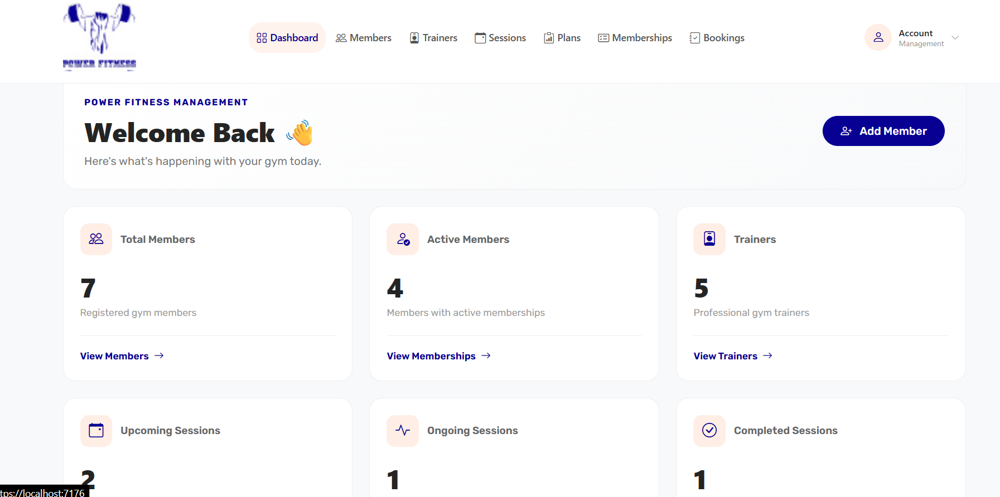
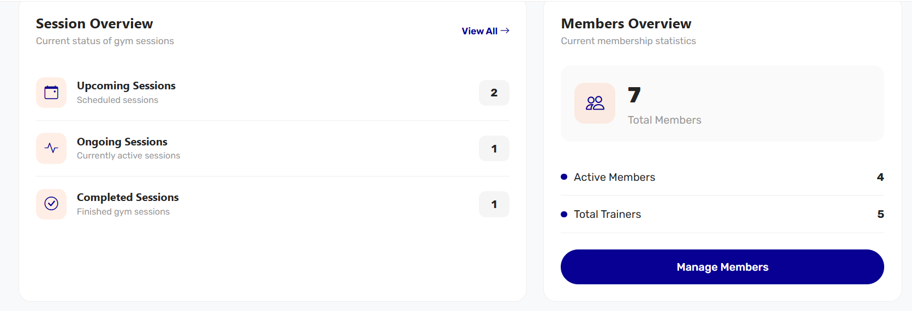
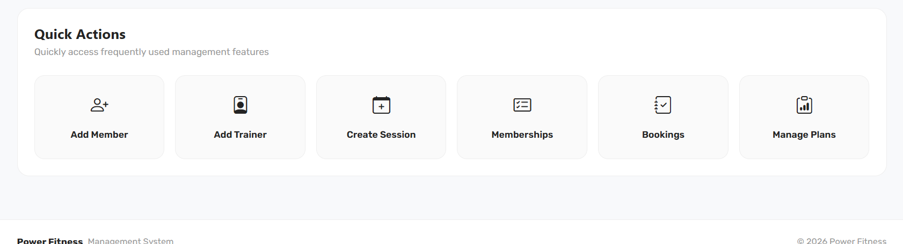


### Member Management

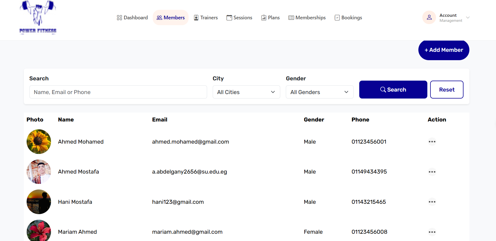
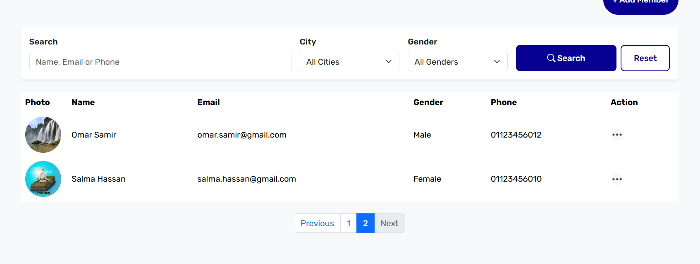

### Trainer Management

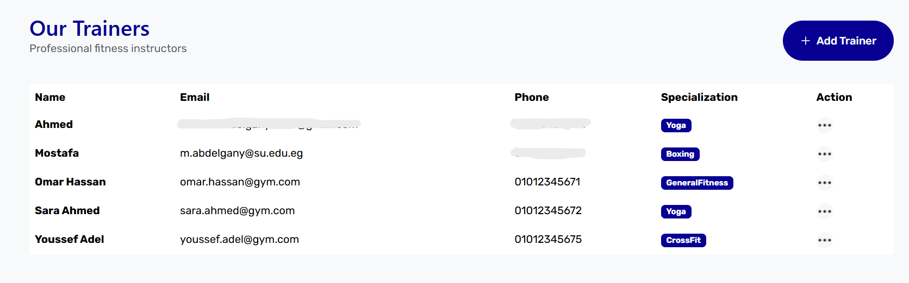

### Session Management

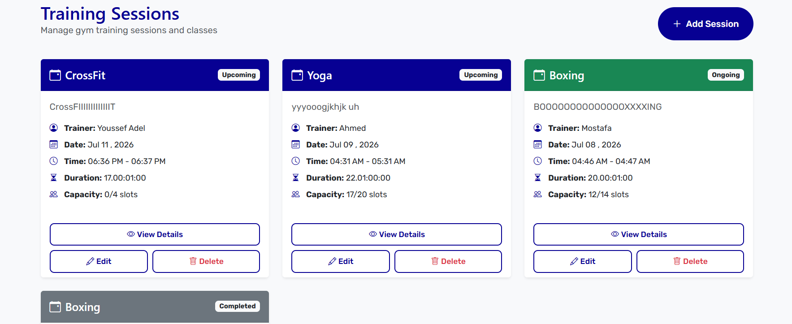

### Membership Plans

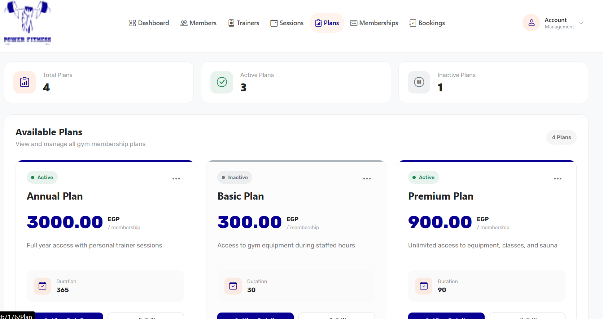
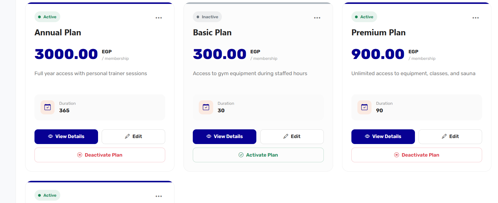

### Membership Management

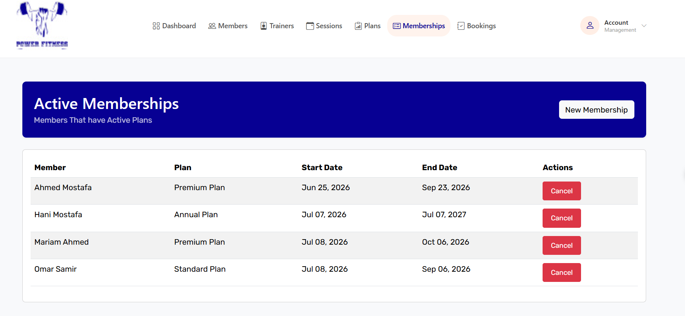

### Booking Management

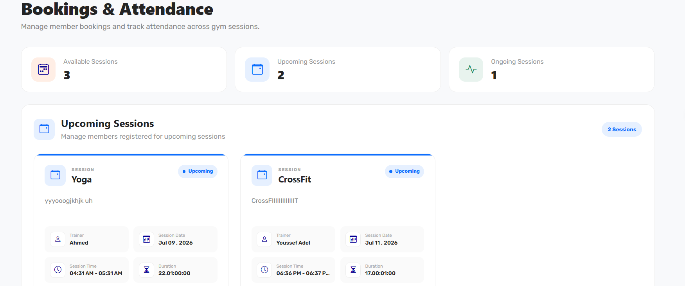
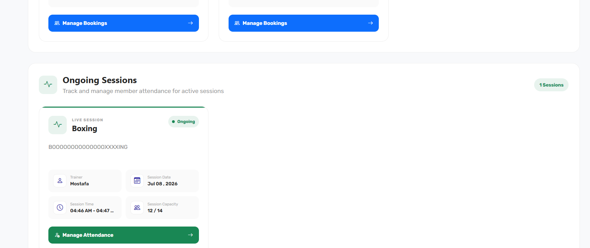

### Attendance Management

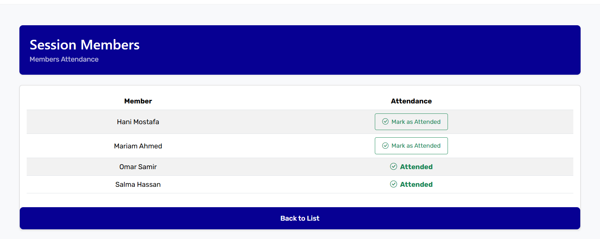

---

---

## 🔮 Future Improvements

Possible future enhancements include:

- ASP.NET Core Identity integration
- Role-Based Authorization
- Advanced Dashboard Analytics
- Membership Expiration Notifications
- Email Notifications
- Payment Integration
- Advanced Reporting
- Export Reports to PDF
- Export Reports to Excel
- Automated Unit Testing
- Integration Testing
- REST API Integration
- Improved Logging
- Global Exception Handling

---

## 🎯 Project Goals

This project was developed to practice and demonstrate:

- Building real-world applications using ASP.NET Core MVC
- Applying N-Tier Architecture
- Working with Entity Framework Core
- Designing relational database models
- Implementing Repository and Unit of Work Patterns
- Applying Dependency Injection
- Managing business logic through application services
- Using AutoMapper
- Implementing Result Pattern
- Building server-side pagination and filtering
- Managing file uploads
- Applying real-world business rules
- Using Git and GitHub for version control

---

## 👨‍💻 Author

**Ahmed Mostafa Mohamed**

Backend .NET Developer

GitHub: **AhmedMostafa2029**

---

## 📄 License

This project was developed for educational and portfolio purposes.